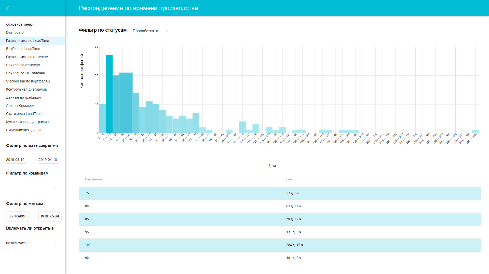
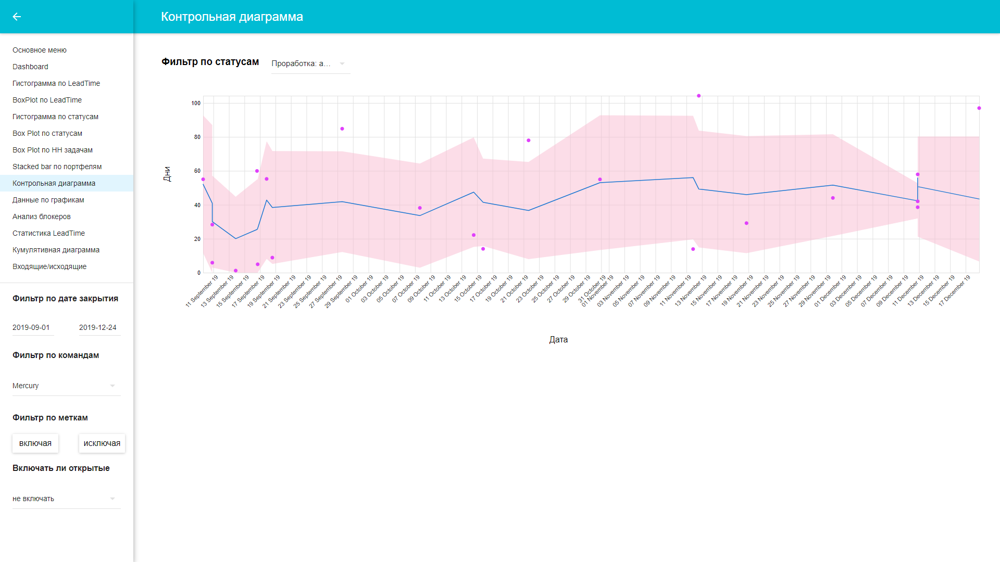
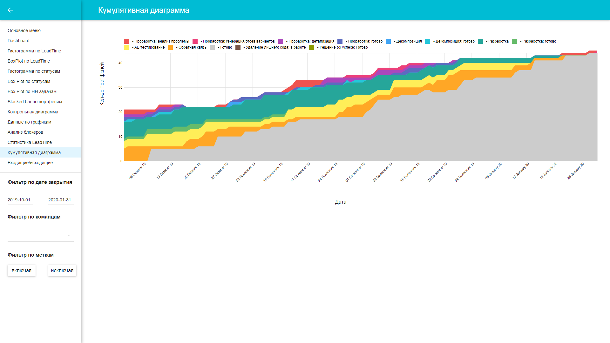

# kanban-meter

**kanban-meter** - это open source система, созданная в компании HeadHunter, которая позволяет создавать и собирать метрики здоровья процесса согласно Канбан-методу, а также находить и видеть узкие места. Данные для анализа загружаются из Jira. 

Цель анализа метрик - позволить:

* быстрее делать то же количество проектов,
* делать больше проектов тем же количеством людей,
* понимать, где на самом деле не хватает людей, или искать варианты оптимизации иными способами;

В kanban-meter используются стандартные метрики для Канбана:

* **время жизни работы** – сколько времени проходит с момента взятия задачи в работу до ее релиза на пользователей
* **эффективность потока** – соотношение полезного времени, когда по задаче шла работа ко всему времени жизни задачи
* **анализ блокеров** – из-за каких причин чаще всего происходит торможение задач
 
На основе этих метрик проводиться анализ, например, на ревью сервиса поставки и принимаются решения об изменениях в процессе с целью ускорять выпуск задач.
 
## Примеры отчетов:

### Распределение по времени производства

### Контрольная диаграмма

### Кумулятивная диаграмма

